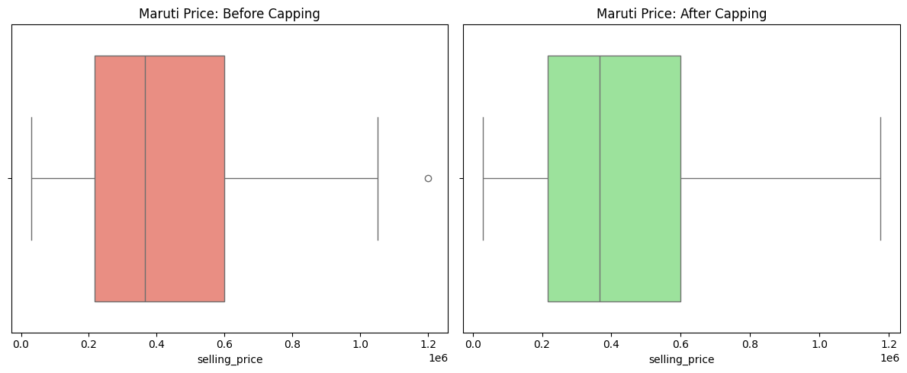
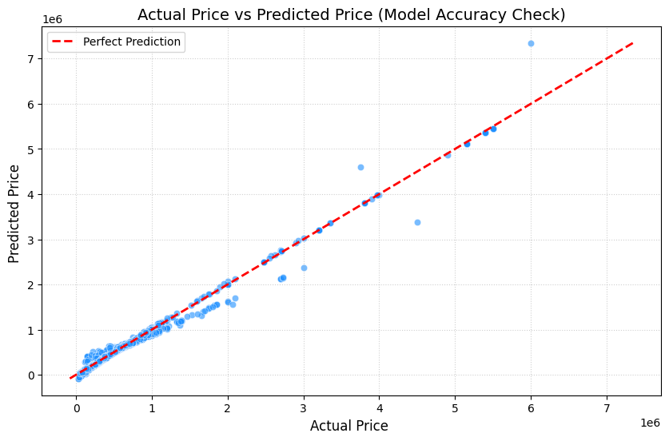

# 🚗 Used Car Price Prediction (End-to-End ML Pipeline)

A complete Data Science and Machine Learning project built using Python to clean, analyze, and predict used car prices based on vehicle specifications.

---

## 🛠️ Tech Stack & Libraries Used
* *Language:* Python 3.12
* *Libraries:* Pandas, NumPy, Matplotlib, Seaborn, Scikit-Learn

---

## 🚀 Key Features & Project Workflow

### 1. Data Cleaning & Preprocessing
* Converted messy text data into numeric formats (e.g., stripping strings like kmpl, CC, bhp from mileage, engine, and max_power).
* Handled missing values using group-wise and feature-wise median imputation.

### 2. Outlier Management (The Maruti Clean-up)
* Implemented *Group-Wise IQR (Interquartile Range) Capping*.
* Cleaned isolated high-price anomalies within specific brands (like Maruti) to prevent machine learning distortion.

### 3. Feature Engineering & Selection
* Created premium domain-specific logics:
  * car_age: Calculated based on the current year (2026).
  * km_per_year: Calculated the average usage intensity of vehicles.
  * price_per_seat: Extracted a pricing ratio relative to seating capacity.
* Dropped complex text columns like torque to streamline training efficiency.

### 4. Categorical Encoding & Modeling
* Used *One-Hot Encoding* (pd.get_dummies) to translate categorical variables (fuel, transmission, seller_type, owner) into structural numeric inputs.
* Split data into an *80/20 Train-Test split*.
* Trained a *Linear Regression* model to accurately map specifications against the target variable (selling_price).

---

## 📊 Project Visualizations

### 1. Outlier Capping (Maruti Brand Clean-up)

### 2. Model Performance (Actual vs Predicted Prices)

